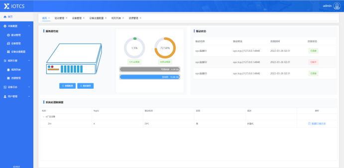
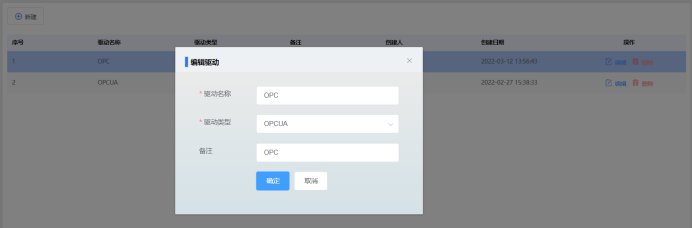
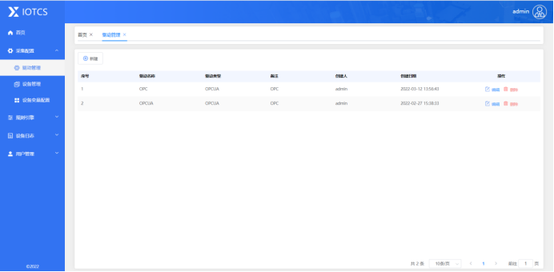
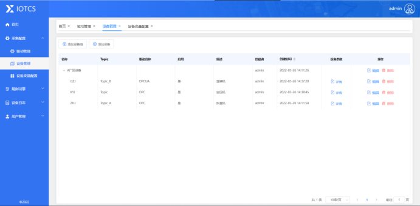
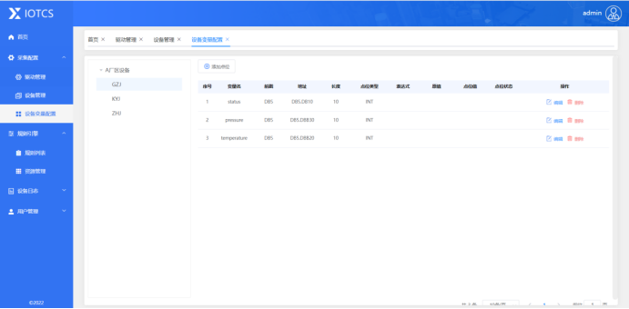
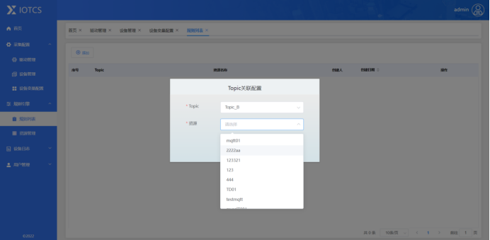
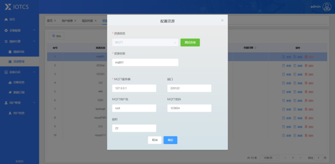
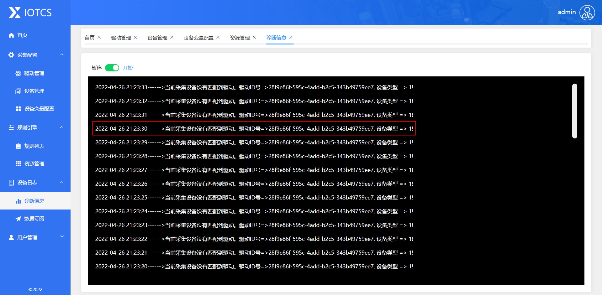

# IOTCS
# Gitee地址：https://gitee.com/wittqueen/IOTCS/
* 在线体验iotcs后台：http://47.108.190.157/ 
* 在线教程文档地址：http://47.108.190.157:8080/index.html

工业智能网关，基于.net core3.1的跨平台物联网网关。是一款具备采集工业设备数据并接入到自主开发的云平台。支持不同设备驱动(PLC、数据库、串口设备、上位机、OPC UA、MQTT）具备二次开发驱动的能力实现与Thingsboard进行数据通讯。同时支持MQTT、MYSQL、WEBHOOK等多种资源配置化管理，实现数据的快速推送，提供简单的驱动接口开发。  
### 主要亮点：
* 内置Mqtt服务端,支持websocket,进行标准mqtt输出
* 可视化的驱动设备配置实现数据采集
* 支持工业现场的多种设备协议
* 支持驱动二次开发
* 内置OPCUA驱动协议
* 内置西门子S7协议
* 内置Modbus驱动全协议支持
* 内置欧姆龙PLC驱动（待开发中）
* 内置三菱PLC驱动（待开发中）

 


# 安装部署

# 安装运行条件
## Windows主机运行：
* 下载windows运行环境：安装.net core3.1   
  *   官方下载地址：https://dotnet.microsoft.com/zh-cn/download/dotnet/thank-you/runtime-aspnetcore-3.1.24-windows-x64-binaries   
  *   安装运行环境：
  *   将安装好的bin目录加入到windows PATH环境变量里
  *   验证是否安装成功：dotnet --info  
* 下载release 版本   
  *   将压缩包解压到指定的位置
  *   进入到App目录后，执行如下命令:dotent IOTCS.EdgeGateway.Server.dll 或者执行 IOTCS.EdgeGateway.Server.exe 
* windows 运行请在生产环境中安装成windows服务
## Linux主机运行：
* 下载Linux运行环境：安装.net core3.1   
  *   官方下载地址：https://dotnet.microsoft.com/zh-cn/download/dotnet/thank-you/runtime-aspnetcore-3.1.24-linux-x64-binaries
  *   安装运行环境
  ```
  tar -zxvf aspnetcore-runtime-3.1.24-linux-x64.tar.gz -C /opt/netcoresdk/
  ln -s /opt/netcoresdk/ /usr/local/bin
  ```
  *   验证是否安装成功：dotnet --info
* 下载release 版本  
  *   将压缩包解压到指定的位置
  *   然后，进入到App目录后，执行如下命令:dotent IOTCS.EdgeGateway.Server.dll  
* Linux 运行请安装成systemd服务   
* 安装步骤   
```
vim /usr/lib/systemd/system/gatewayd.service  

[Unit]   
Description=Gateway System Service   
After=network.target   

[Service]   
WorkingDirectory=/gateway/netcore/IOTCS   
Type=simple   
User=root   
Group=root   
ExecStart=/gateway/sdk/dotnet IOTCS.EdgeGateway.Server.dll   
Restart=always   
RestartSec=10   
SyslogIdentifier=dotnet-zl   
Environment=ASPNETCORE_ENVIRONMENT=Production   
Environment=DOTNET_PRINT_TELEMETRY_MESSAGE=false   

[Install]   
WantedBy=multi-user.target   
```
# 责任说明
### 实际生产环境中请使用OPCUA基金会授权   
## linux/amd64 docker运行
```
docker pull iotcs/igateway:0.6

docker run --restart always --name iigateway -dit -p 8001:8001 -p 9001:9001 iotcs/igateway:0.6
```
# 功能说明
#### 登入系统   
* 用户名 admin,密码 1111  

#### 驱动管理
* 驱动配置  


#### 设备管理
* 设备组的统一管理，设备通过父级ID关联设备组
* 设备参数配置  
* 设备变量配置  


#### 规则管理
* 规则列表
* 资源管理  


#### 设备日志
* 诊断日志   

#### 联系我们
* 微信号：Hearteen ``浩瀚星辰`` 
* 公众号   

